# MouliMc tuto

Ce document a pour but d’expliquer comment se connecter à la MouliMC.

La partie d’installation ne devrait être faite **qu’une seule fois** (à moins que vous ayez réinstallé votre launcher). La partie “Jouer” décrit les instructions qui devront être répétées **à chaque fois que vous voulez vous connecter** au serveur.

> [!NOTE]
> Dans le cas ou vous jouez sur les ordinateurs du PIE, l'installation devra être réalisée à chaque fois puisque Prism launcher n'est pas installé dans l'afs.

Si vous rencontrez des problèmes, n’hésitez pas à contacter @lomination ou @valentin_kh sur discord !

- [MouliMc tuto](#moulimc-tuto)
- [Installation](#installation)
  - [Installer un launcher](#installer-un-launcher)
    - [PrismMC (officiel)](#prismmc-officiel)
    - [PrismMC sur le PIE (officiel)](#prismmc-sur-le-pie-officiel)
    - [UltimMC (crack)](#ultimmc-crack)
  - [Configurer une instance](#configurer-une-instance)
  - [S’authentifier via discord](#sauthentifier-via-discord)
- [Jouer](#jouer)
- [Troubleshooting](#troubleshooting)
  - [Crash au lancement à cause d’une OutOfMemoryError](#crash-au-lancement-à-cause-dune-outofmemoryerror)
  - [PrismMC Linux : drivers ou libraries non trouvées](#prismmc-linux--drivers-ou-libraries-non-trouvées)
- [FAQ](#faq)
  - [Peut-on jouer en crack ?](#peut-on-jouer-en-crack-)
  - [Comment changer le pseudo minecraft lié à son compte discord ?](#comment-changer-le-pseudo-minecraft-lié-à-son-compte-discord-)


# Installation

## Installer un launcher

Il est possible d’utiliser de nombreux launchers. Cependant, nous allons nous concentrer sur deux d’entre eux : PrismMC et UltimMC. Nous vous **conseillons fortement d’utiliser PrismMC** sauf dans le cas où vous ne disposez pas de compte Microsoft avec Minecraft dessus. Dans ce cas, utilisez UltimMC.

<details name="issue">
  <summary>
  
  ### PrismMC (officiel)

  </summary>
  <p><blockquote>

  Pour commencer, rendez-vous sur le [**site de Prism**](https://prismlauncher.org/download/). Sélectionnez votre OS (Linux, macOS, Windows) et **suivez les instructions d'installation**.

  Une fois l'installation terminée, lancez PrismMC. Le launcher vous demandera de vous authentifier. **Connectez-vous** à votre compte Microsoft sur lequel Minecraft est installé.

  Vous devriez ensuite tomber sur cette page :

  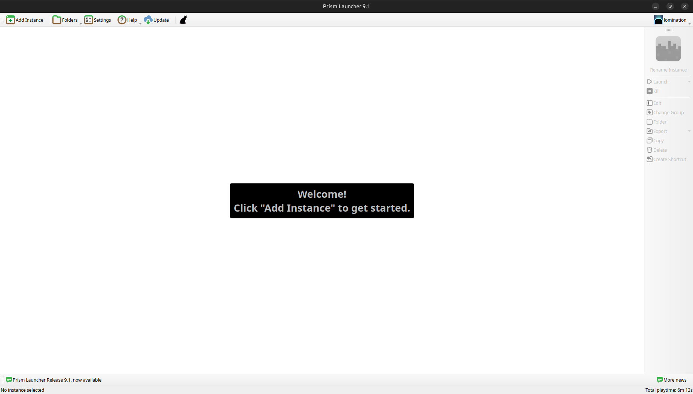
  
  </blockquote></p>
</details>

<details name="issue">
  <summary>
  
  ### PrismMC sur le PIE (officiel)

  </summary>
  <p><blockquote>

  Ouvrez un terminal et exécutez la commande suivante :
  ```bash
  nix-shell -p prismlauncher
  ```
  
  Cette commande vous ouvrira un terminal différent de celui que vous avez l'habitude de voir, un shell nix. Dans ce dernier, lancez la commande :
  ```bash
  prismlauncher
  ```

  Choisissez la langue de votre choix.

  **Veillez à selecionner la version 17 de Java, le modpack de la MoulinetteMC n'étant compatible qu'avec cette version.**

  Connectez vous ensuite à votre compte Minecraft / Microsoft en suivant les instructions à l'écran.

  Une fois ces étapes faites, vous devriez tomber sur cette page :

  
  
  </blockquote></p>
</details>

<details name="issue">
  <summary>
  
  ### UltimMC (crack)

  </summary>
  <p><blockquote>

  Pour commencer, rendez-vous sur le [**github de UltimMC**](https://github.com/UltimMC/Launcher?tab=readme-ov-file#downloading). Téléchargez UltimMC en cliquant sur votre OS (Linux, macOS, Windows), puis unzippez le launcher à l’endroit de votre choix.

  Une fois l’installation terminée, lancez UltimMC. Vous devriez ensuite tombez sur cette page :

  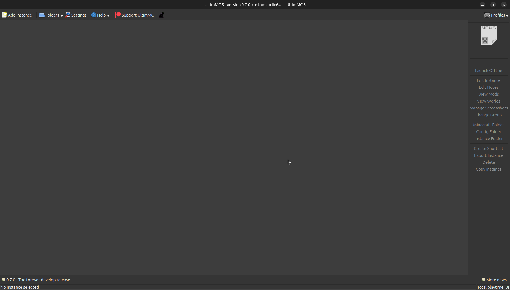

  Cliquez en haut à droite de la fenêtre sur `Profiles` pour configurer votre utilisateur Minecraft. Une autre fenêtre devrait s’ouvrir :

  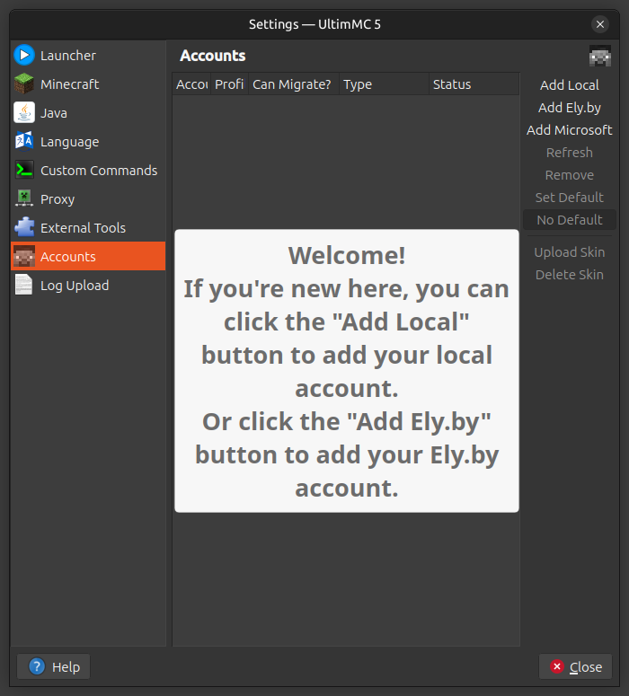

  Cliquez sur `Add local` et saisissez le nom d’utilisateur Minecraft que vous souhaitez. **Ce nom vous sera demandé lors de l’authentification par discord.** Ensuite, fermez la fenêtre.

  Vous devriez voir votre nom d’utilisateur apparaître en haut à droite de votre écran à la place de `Profiles` comme ci-dessous :

  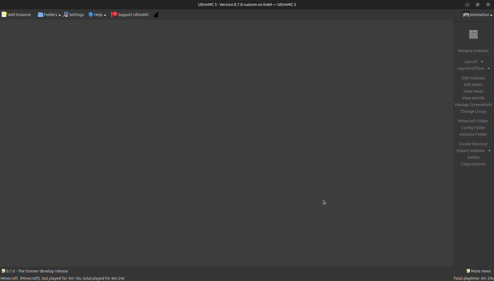
  
  </blockquote></p>
</details>

## Configurer une instance

Il faut maintenant que vous configuriez une nouvelle instance de Minecraft sur votre launcher.

Commencez par **télécharger le modpack** si dessous. Il contient tous les mods pour pouvoir jouer sur le serveur. **Vous ne devez pas l’unzip**, votre launcher s’en charge pour vous.

[gamefiles-main.zip](https://github.com/moulinettemc/gamefiles/archive/refs/heads/main.zip)

Allez ensuite sur l’écran d’accueil de votre launcher. Cliquez sur le bouton `Add Instance` en haut à gauche de votre écran. Une nouvelle fenêtre devrait s’afficher sur votre écran :

| PrismMC                          | UltimMC                          |
| -------------------------------- | -------------------------------- |
| 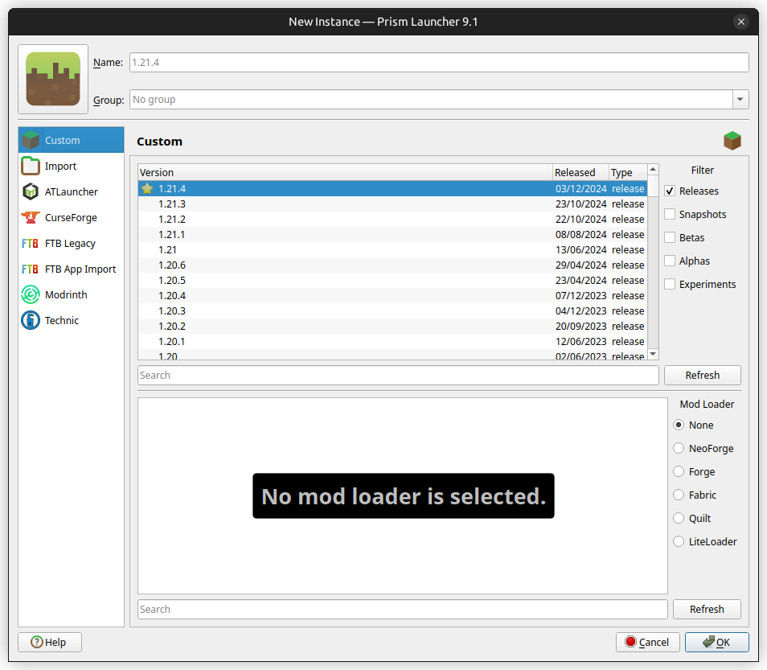 | 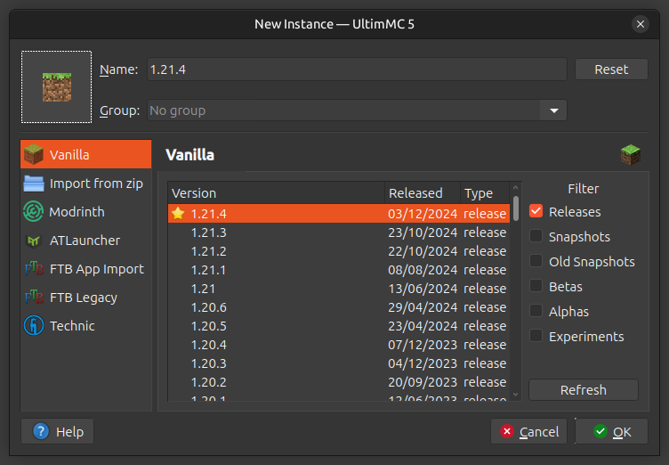 |

Cliquez sur `Import` depuis le menu vertical de gauche. Puis, cliquer sur le bouton `Browse` pour parcourir vos fichiers. **Sélectionnez ensuite le modpack gamefiles-main.zip** précédemment téléchargé.

Enfin, si vous le souhaitez, vous pouvez **donner un nom** (celui que vous voulez) à votre instance en haut de la fenêtre. Vous devriez obtenir quelque chose qui ressemble à ça :

| PrismMC                          | UltimMC                          |
| -------------------------------- | -------------------------------- |
| 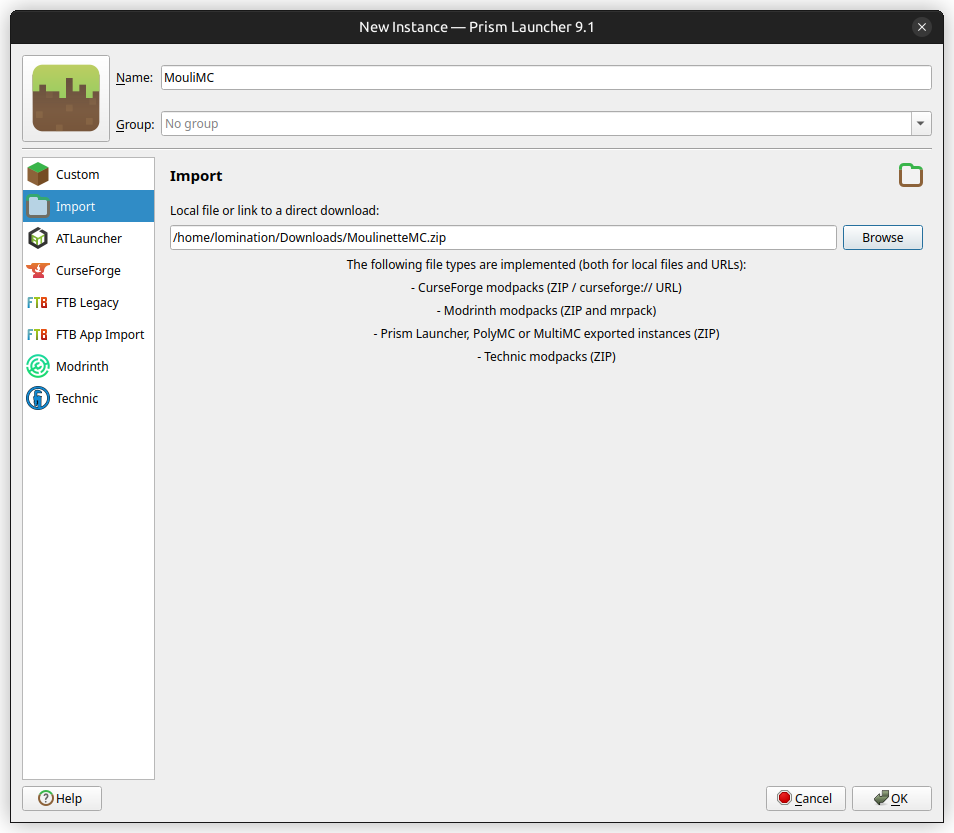 | 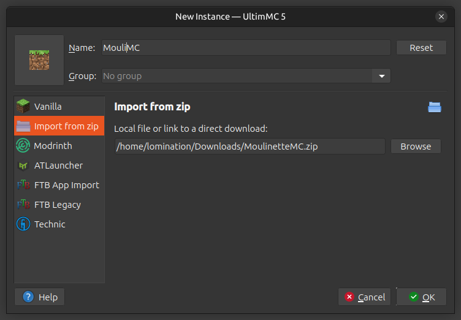 |

Vous pouvez maintenant cliquer sur `Ok`. Patientez le temps que le launcher crée l’instance.

## S’authentifier via discord

Avant de pouvoir vous connecter au serveur, il vous reste une dernière étape. Vous devez vous **authentifier**. Pour ce faire, aller sur le **serveur discord de la A1**. Vérifiez que vous possédez bien le rôle `#GPTlaMouli`, si ce n'est pas le cas, demandez le à @lomination ou @valentin_kh dans le salon `#🧭▸moulinette`. Utilisez ensuite la commande `/register` dans n’importe quel salon, suivie votre **nom d’utilisateur Minecraft**. Normalement, le bot GPTlaMouli devrait répondre “Registred !” comme ci-dessous :

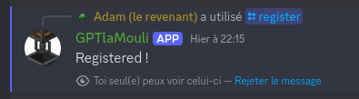

> [!NOTE]
> La commande `/register` ne doit être utilisé qu'une seule fois. [Il est cependant possible de se rename.](#comment-changer-le-pseudo-minecraft-lié-à-son-compte-discord-)

Et voilà ! Vous êtes maintenant authentifié !

Assurez-vous d'avoir activé les **messages privés** provenant des membres des serveurs dont vous faites partie ! Sinon, vous ne recevrez pas les messages de GPTlaMouli et par conséquent vous ne pourrez pas vous connecter à la MouliMC.

# Jouer

Lancez votre instance précédemment configurée en cliquant deux fois dessus ou en la sélectionnant puis en cliquant sur `Launch` dans le menu à droite votre écran.

Une fois votre jeu lancé, il vous suffit de cliquer sur le bouton `Multiplayer` du menu de Minecraft pour vous connecter au serveur. Vous serez **automatiquement connecté à la MouliMC**, pas besoin d’ip !
Vous devriez tomber sur cette page :

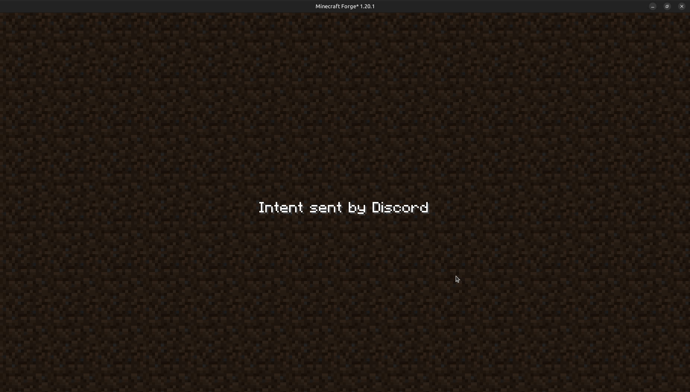

Ouvrez discord. Le GPTlaMouli devrait vous envoyer un message privé comme ci-dessous:

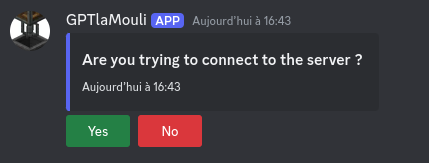

Cliquez sur `Yes` et revenez sur Minecraft.

**Veuillez ne pas accepter une demande de connexion qui ne vient pas de vous !**

Lors de la première connexion ou lorsque le modpack a été mis à jour, un court chargement apparaîtra accompagné d’une douce musique 🎵. Les mods seront simplement en train d’être synchronisé avec le serveur. Une fois le chargement terminé, vous devez relancer votre jeu pour charger les mods qui viennent d'être téléchargés.

Vous êtes maintenant connecté et vous pouvez jouer ! Amusez-vous bien !

# Troubleshooting

<details name="issue">
  <summary>
  
  ## Crash au lancement à cause d’une OutOfMemoryError
  
  </summary>
  <p><blockquote>

  Il arrive que le jeu crash lors du chargement de Minecraft à cause d’un manque RAM. Pour résoudre ce problème, allez dans les paramètres de l’instance (sélectionnez l’instance dans votre launcher et cliquez `Edit` sur PrismMC ou `Edit Instance` sur UltimMC), dans l’onglet `Settings` puis `Java`. Modifiez la valeur `Maximum memory allocation` à 2000 megaoctets (soit 2 gigaoctets) ou plus.

  | PrismMC                           | UltimMC                           |
  | --------------------------------- | --------------------------------- |
  | 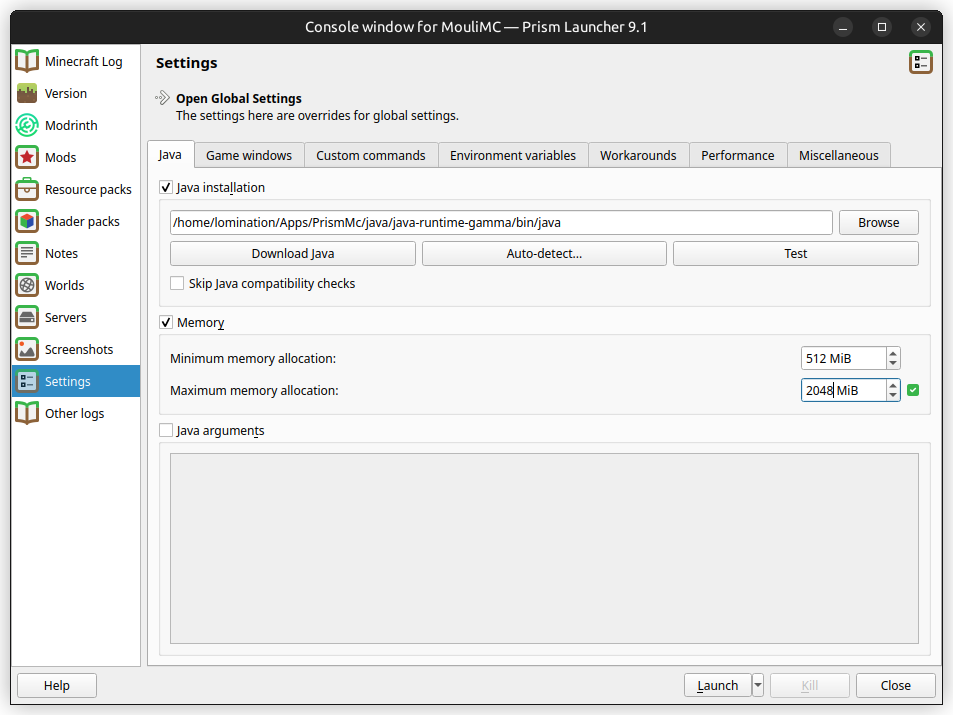 | 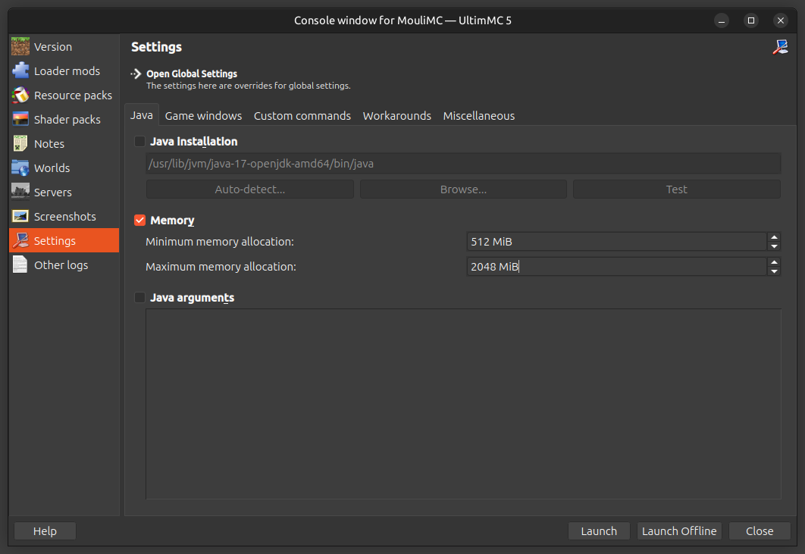 |
  
  Relancez votre jeu et le problème devrait disparaître !
  
  </blockquote></p>
</details>

<details name="issue">
  <summary>
  
  ## PrismMC Linux : drivers ou libraries non trouvées

  </summary>
  <p><blockquote>

  PrismMC semble avoir une drôle de gestion de dépendances. Si vous rencontrez des problèmes de drivers ou de libraries telles que libstdc++ qui ne sont pas trouvés ou pas dans la bonne version, contactez @lomination. Il pourra peut-être vous aider.
  
  </blockquote></p>
</details>

# FAQ

<details name="question">
  <summary>
  
  ## Peut-on jouer en crack ?

  </summary>
  <p><blockquote>

  Oui, il vous suffit d'utiliser UltimMC au lieu de PrismMC.
  
  </blockquote></p>
</details>

<details name="question">
  <summary>
  
  ## Comment changer le pseudo minecraft lié à son compte discord ?

  </summary>
  <p><blockquote>

  Si vous vous êtes trompé de nom lors du `/register` ou que vous souhaitez jouer avec un autre compte minecraft, vous pouvez vous renommer. Pour cela, utilisez la command `/rename` suivie de votre nouveau nom Minecraft.

  Notez qu'utiliser à nouveau la commande `/register` produira une erreur de ne fonctionnera pas. Le `/register` ne doit être utilisé qu'une seule fois.
  
  </blockquote></p>
</details>
