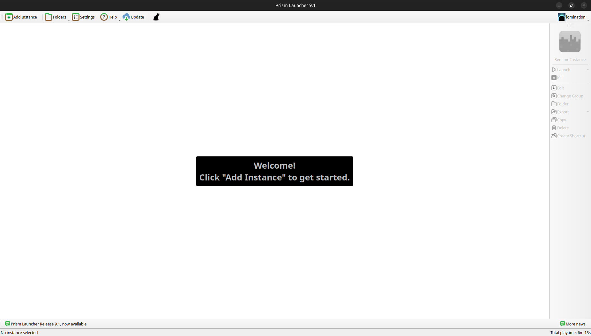

# MouliMc tuto

Ce document a pour but d’expliquer comment se connecter à la MouliMC.

Il comprend deux partie : “**Installation**” et “**Jouer**”. La partie d’installation ne devrait être faite qu’une seule fois (à moins que vous ayez réinstallé votre launcher). La partie “Jouer” décrit les instructions qui devront être répétées **à chaque fois que vous voulez vous connecter** au serveur.

Si vous rencontrez des problèmes, n’hésitez pas à contacter @lomination ou @valentin_kh sur discord !

# Installation

## Prérequis

Pour pouvoir suivre ce tutoriel, vous devez disposer d’un compte Microsoft avec Minecraft. Il est possible de jouer sur la MouliMC sans compte Minecraft premium mais en utilisant un autre launcher que Prism (Prism n’autorisant pas de jouer en crack).

Vous devez aussi être sur le serveur discord de la A1.

## Installer Prism Launcher

Pour jouer il vous faut installer un launcher Minecraft. Bien qu’il soit possible d’utiliser d’autres launchers, nous vous conseillons d’utiliser **Prism Launcher**. Il facilitera l’installation et la gestion du modpack.

Pour commencer, rendez-vous sur le [**site de Prism**](https://prismlauncher.org/download/). Sélectionnez votre OS (Linux, macOS, Windows) et **suivez les instructions d'installation**.

Une fois l’installation terminée, vous pouvez lancer Prism. Le launcher devrait vous demander de vous authentifier. **Connectez vous** à votre compte Microsoft sur lequel vous avez Minecraft.

Vous devriez ensuite tombez sur cette page :

## Configurer une instance

Il faut maintenant que vous configuriez une nouvelle instance moddée de Minecraft sur Prism.

Commencez par **télécharger le modpack** si dessous. Il contient tous les mods pour pouvoir jouer sur le serveur. **Vous ne devez pas l’unzip**, Prism s’en charge pour vous.

[MoulinetteMC.zip](https://github.com/moulinettemc/moulinette/archive/refs/heads/main.zip)

Revenez ensuite sur l’écran d’accueil de Prism montré ci-dessus. Vous devez  créer une nouvelle instance en utilisant le modpack que vous venez de télécharger. Pour cela cliquer sur le bouton **Add Instance** en haut à gauche de votre écran. Cette fenêtre devrait s’afficher sur votre écran :

Cliquez sur **Import** depuis le menu vertical de gauche. Puis, cliquer sur le bouton **Browse** pour parcourir vos fichiers. **Sélectionner ensuite le modpack MoulinetteMC.zip** précédemment téléchargé.

Enfin, vous pouvez **donner un nom** (celui que vous souhaitez) à votre instance en haut de la fenêtre. Vous devriez obtenir quelque chose qui ressemble à ça :

Vous pouvez maintenant cliquer sur Ok. Patientez le temps que le launcher crée l’instance.

## S’authentifier via discord

Avant de pouvoir vous connecter au serveur, il vous reste une dernière étape. Vous devez vous **authentifier**. Pour ce faire, aller sur le **serveur discord de la A1**. Utilisez la commande **`/register`** dans n’importe quel salon, suivie votre **nom d’utilisateur Minecraft**. Normalement, le bot GPTlaMouli devrait répondre “Registred !” comme ci-dessous :

Et voilà ! Vous êtes maintenant authentifié !

Assurez-vous d'avoir activé les **messages privés** provenant des membres des serveurs dont vous faites partie ! Sinon, vous ne recevrez pas les messages de GPTlaMouli et par condéquent vous ne pourrez pas vous connecter à la MouliMC.

# Jouer

Lancez votre instance précédemment configurée en cliquant deux fois dessus ou en la sélectionnant puis en cliquant sur Launch dans le menu à droite votre écran.

Une fois votre jeu lancé, il vous suffit de cliquer sur le bouton Multiplayer du menu de Minecraft pour vous connecter au serveur. Vous serez **automatiquement connecté à la MouliMC**, pas besoin d’ip !
Vous devriez tomber sur cette page :

Ouvrez discord. Le GPTlaMouli devrait vous envoyer un message privé comme ci-dessous:

Cliquez sur Yes et revenez sur Minecraft.

**Veuillez ne pas accepter une demande de connexion qui ne vient pas de vous !**

Lors de la première connexion ou lorsque le modpack a été mis à jour, un court chargement apparaîtra accompagné d’une douce musique 🎵. Les mods seront simplement en train d’être synchronisé avec le serveur.

Vous êtes maintenant connecté et vous pouvez jouer ! Amusez-vous bien !